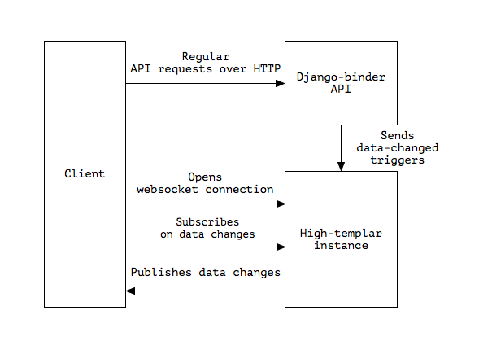

high-templar
====================

|build_status|_ |code_coverage|_

A python framework for creating a stateful server which handles websocket functionality for an existing HTTP only API.

Flow
----------

- A client opens a websocket connection with a High-templar instance.
- The HT instance proxies the request to the API, which in turn handles authentication and provides a list of rooms.
- The HT instance tells the client what rooms he is allowed to subscribe to.
- The client subscribes to one or more rooms
- When receiving a trigger from the API, the HT instance publishes the received data to the specified rooms.

|architecture|

Installation
------------

.. code:: bash

    pip install high-templar

Motivation
----------
This project is created for handling websockets for a django instance.
Django doesn't support websockets out of the box. To add websocket support to Django, one can either
monkey patch the Django WSGI with gevent, or use django-channels which requires a lot of configuration and needs you to manage its workers.

High-templar uses a similar approach to django-channels, but uses internal HTTP requests to communicate with the existing Django instance. High-templar keeps track of the active websocket connections, which allows the Django instance to remain stateless.

Origin
----------
This repository is based on archon_. Archon is a framework for creating full fledged websocket based CRUD APIs. High-templar is only half the framework of Archon, as it relies on an existing API and only provides pubsub.

.. _archon: https://github.com/JasperStam/archon
.. |build_status| image:: https://travis-ci.org/CodeYellowBV/high-templar.svg?branch=master
.. _build_status: https://travis-ci.org/CodeYellowBV/high-templar
.. |code_coverage| image:: https://codecov.io/gh/CodeYellowBV/high-templar/branch/master/graph/badge.svg
.. _code_coverage: https://codecov.io/gh/CodeYellowBV/high-templar
